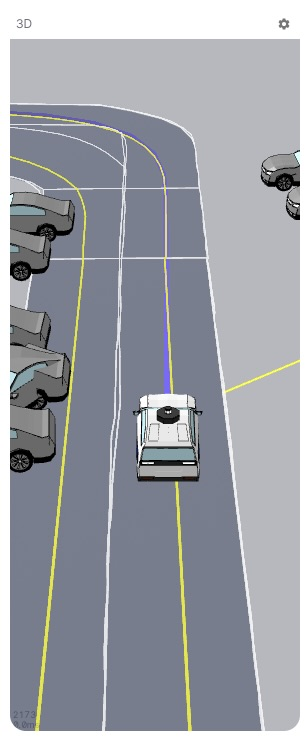
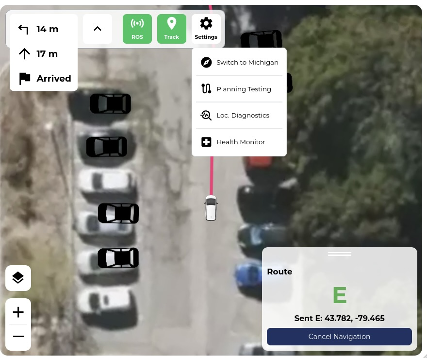
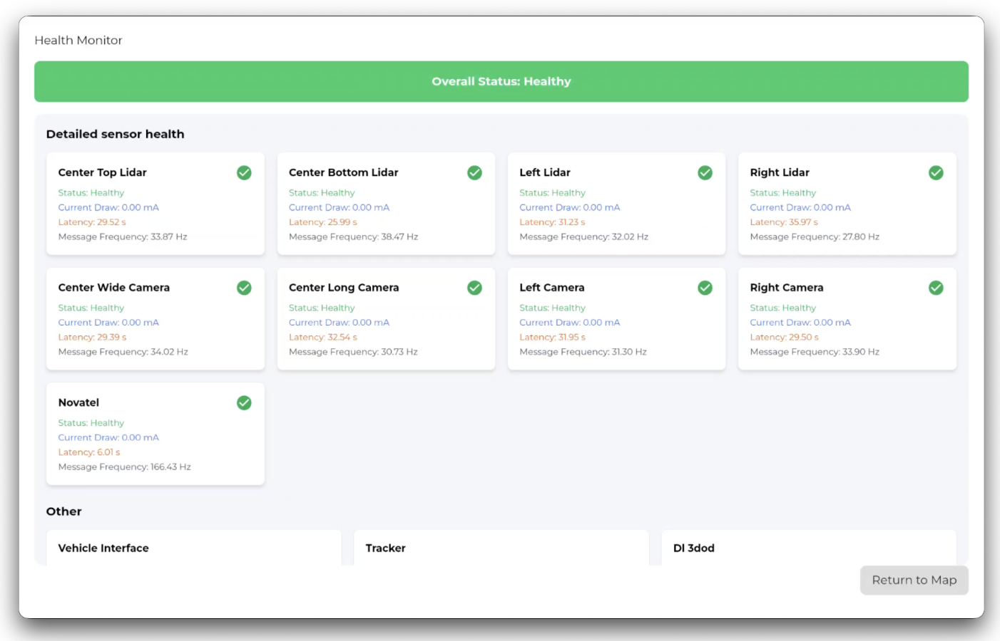
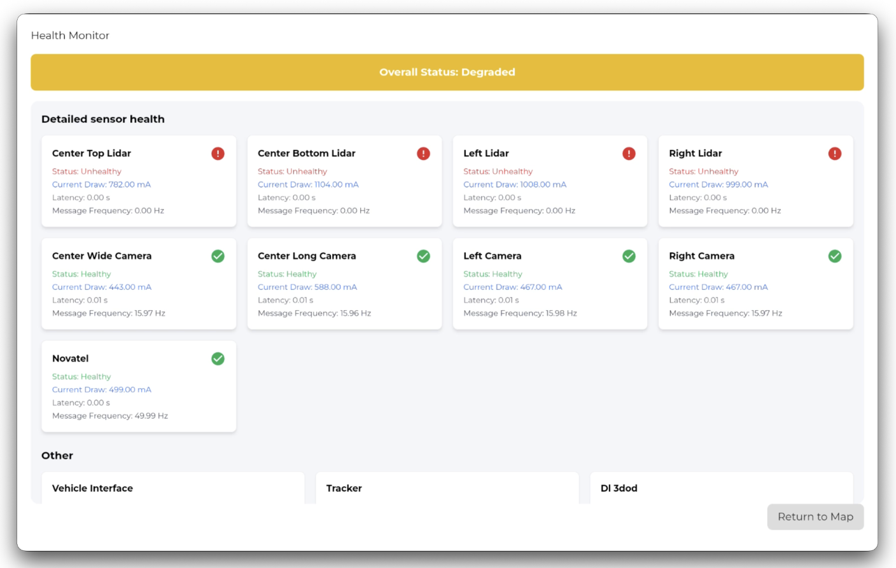
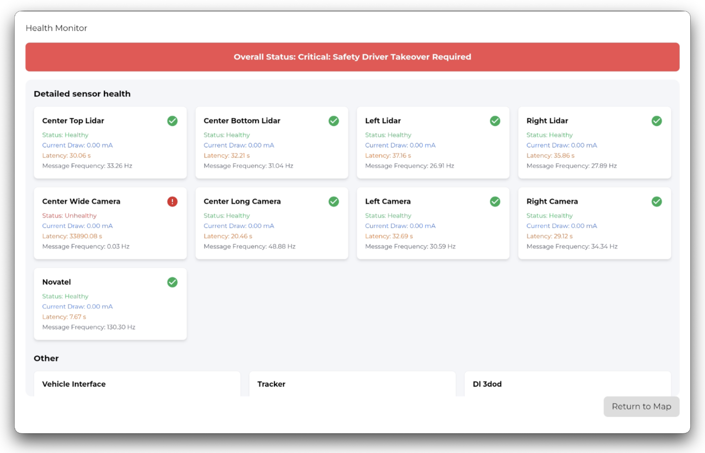
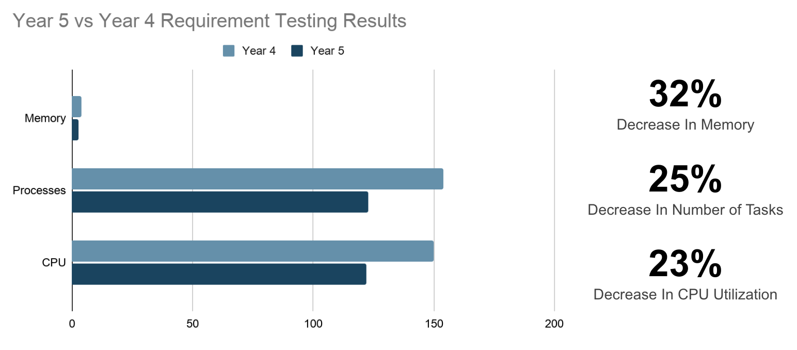

<video width=100% autoplay loop muted playsinline controls>
  <source src="../../asset/GUI_gif.mov" type="video/mp4">
  Your browser does not support the video tag.
</video>
<!--  -->

## Graphical User Interface Team at aUToronto

The University of Toronto's Self-Driving Car Team, [aUToronto](https://www.autodrive.utoronto.ca/), is a student-led design team competing annually in the [GM/SAE AutoDrive Challenge Series](https://www.autodrivechallenge.com/). Our goal is to build a level 4 autonomous vehicle capable of navigating urban driving scenarios at the MCity test facility in Michigan.

While named the Graphical User Interface (GUI) team, we develop all Human-Machine Interfaces (HMI) for the vehicle—ranging from a passenger web app on an in-cabin tablet to a physical Streamdeck interface for controlling ROS nodes.

  
  
Artemis: our self-driving car. Source: aUToronto

### What is Level 4 Autonomy?

Level 4 autonomy refers to a vehicle's ability to drive itself without human intervention under defined operational domains, while still allowing optional manual override.

At aUToronto, our vehicle addresses key autonomy challenges:

1. **Autonomous Navigation**: Vehicles must navigate a complex urban environment autonomously, including handling intersections, traffic signals, and roundabouts.
2. **Object Detection and Avoidance**: Cars must detect and avoid pedestrians, deers, other vehicles, and obstacles in real-time.
3. **Autonomous Parking**: Teams must develop systems for autonomous perpendicular parking.
4. **Path Planning**: Vehicles must create and follow an optimal path, considering dynamic and static objects.
5. **Safety and Reliability**: Ensuring the vehicle operates safely and reliably under various conditions, including inclement weather and different road types.

### My Role & Timeline

1. **August 2024 - August 2025: GUI Team Member**
   - Built a 2D web interface allowing operators to select waypoints and inspect map and trajectory overlays.
   - Assisted with software integration for the Streamdeck controller.

2. **September 2025 - June 2026: GUI Team Lead**
   - Led a sub-team of 4 engineers.
   - Built the 3D perception visualization pipeline using Three.js and customized Foxglove, an open-source data visualization and debugging platform designed for robotics developers.
   - Collaborated with the System Safety team to build the real-time vehicle health monitor.

---

## Why We Needed a Custom HMI

We needed an intuitive interface that serves two purposes:

1. **Passengers & Evaluators:** Clearly show what the car sees (detected objects, planned trajectories) and allow manual intervention if necessary.
2. **Autonomy Engineers:** Monitor stack health, sensor status, and mission progress during track testing without digging through raw logs.

Prior to our sub-team's work, engineers relied on RViz and command-line tools, requiring laptops inside the car during dynamic runs. Additionally, competition rules required us to move away from non-registered developer tools toward an intuitive interface usable by everyone.

---

## Key Implementations

  
  
GUI System Architecture Diagram. Source: aUToronto

### 1. Dual-Panel 2D/3D Web Application on Android Tablet

We built a dual-panel web application running on an in-cabin tablet to monitor vehicle state, select destinations, and engage autonomous mode.

<input type="radio" name="ipad-hmi" id="itab-3d" class="hmi-radio">
<input type="radio" name="ipad-hmi" id="itab-2d" class="hmi-radio">
<input type="radio" name="ipad-hmi" id="itab-health" class="hmi-radio">

<label for="itab-3d" class="ipad-overlay" style="left:0;top:0;width:26%;height:100%;z-index:1;">
3D Map
</label>
<label for="itab-2d" class="ipad-overlay" style="left:26%;top:0;width:74%;height:100%;z-index:1;">
2D Dashboard
</label>
<label for="itab-health" class="ipad-overlay ipad-overlay-health">
Health Monitor
</label>

<h4>B. 3D Spatial Visualizer</h4>

Built with <strong>C++</strong>, <strong>ROS</strong>, <strong>Three.js</strong>, <strong>ROSBridge</strong>, and embedded <strong>Foxglove</strong>:

<ol>
<li>

We rendered lane boundaries and road markings from OpenStreetMap vector data.

</li>
<li>

We added detected objects created with Blender and a custom Three.js plugin.

Car, pedestrian, deer, stop sign (.glb). Source: aUToronto

Cone, barrel, traffic light (Three.js). Source: aUToronto

</li>
</ol>

<h4>A. 2D Dashboard</h4>

Built with <strong>C++</strong>, <strong>ROS</strong>, <strong>React</strong>, <strong>Tailwind CSS</strong>, and <strong>Mapbox GL</strong>:

<ul>
<li>Integrated an interactive 2D map overlay to let passengers and operators select navigation waypoints.</li>
<li>Visualized global route planning, localization states, and stack diagnostics.</li>
<li>Designed clean, responsive UI layouts for quick readability inside the vehicle.</li>
</ul>

<h4>C. Health Monitor</h4>

A real-time monitor displaying sensor states (<strong>Healthy</strong>, <strong>Degraded</strong>, <strong>Takeover</strong>), current draw, message frequency, and topic latency.

Healthy

Degraded

Takeover

When operating autonomously, the indicator shows solid blue lights. If a critical sensor fails, autonomy automatically disengages (flashing blue lights).

<video width="100%" autoplay loop muted playsinline controls style="border-radius:8px;margin-top:8px;display:block;">
<source src="../../asset/GUI_autonomy_kickout_demo.mov" type="video/mp4">
</video>

*Health Monitor co-developed with the System Safety Team.

<label for="itab-3d" class="ipad-pill ipill-3d">3D Map</label>
<label for="itab-2d" class="ipad-pill ipill-2d">2D Dashboard</label>
<label for="itab-health" class="ipad-pill ipill-health">Health Monitor</label>

---

### 2. Physical Streamdeck Controls for ROS Nodes

To satisfy HMI challenge requirements and allow quick intervention, we mapped physical Streamdeck buttons to start and stop key ROS nodes directly without terminal interaction.

Streamdeck used for HMI. Source: aUToronto

_\*Streamdeck software was developed by our team principal Chad and former GUI lead William._

---

## Engineering Challenges

### 3D Rendering Performance on In-Cabin Tablet

- **Problem:** When running on our Android tablet hardware, interacting with the 3D scene (panning and rotating) caused noticeable UI lag and dropped frames during live vehicle testing.
- **Cause:** The visualizer was attempting to process and re-render incoming high-frequency OSMs and spatial coordinate updates directly on every message arrival, causing GPU/CPU contention on the tablet without any buffer or cache.
- **Solution:** I implemented a point queue buffer to decouple incoming ROSBridge data ingestion from the Three.js render loop. This allowed the scene to batch coordinate updates and render predictably according to the screen refresh cycle rather than thrashing on every raw data packet.

Numerical Result of Year 4 vs Year 5 Requirement Testing. Source: aUToronto
