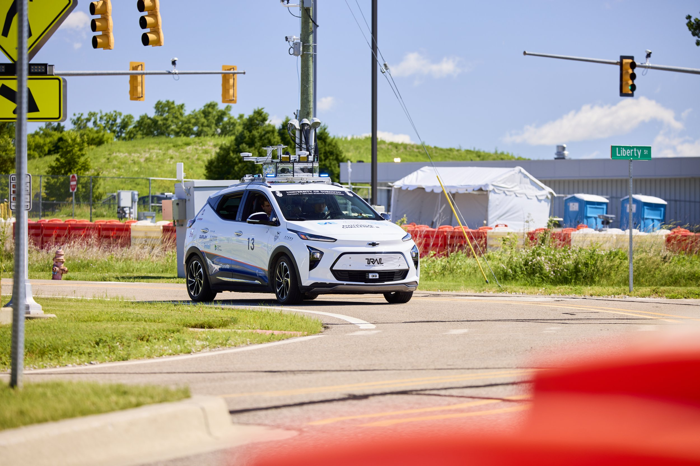
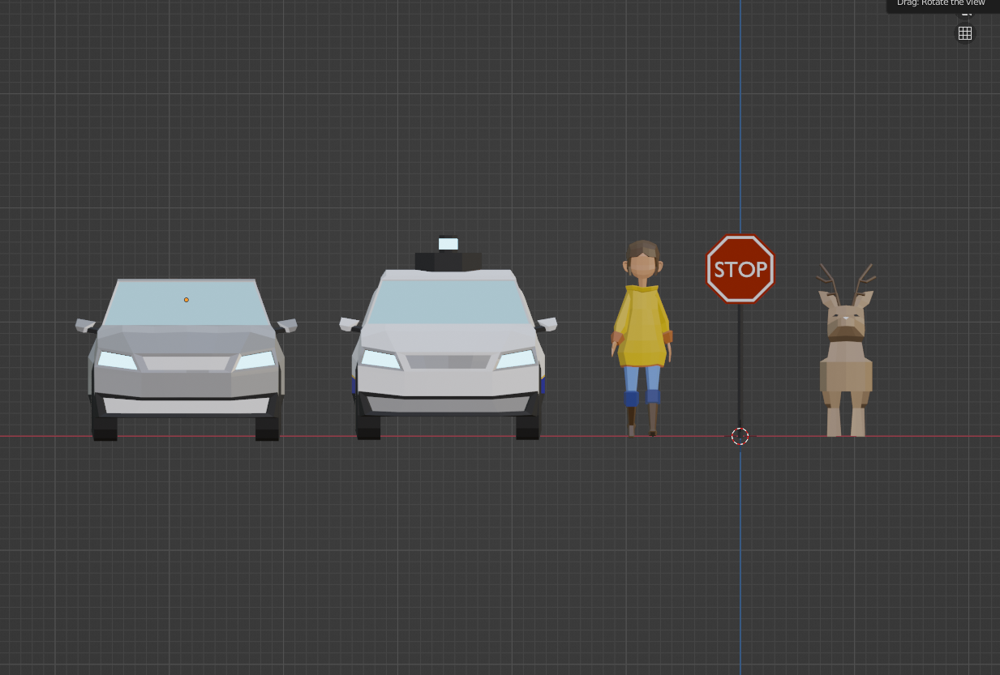
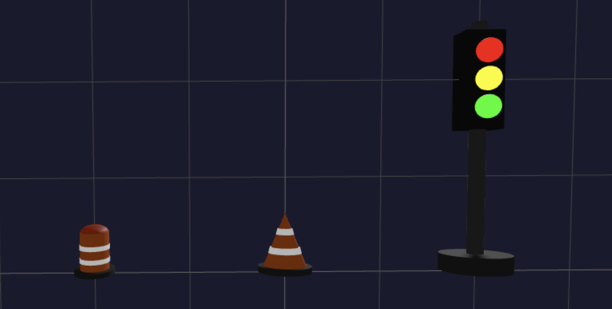
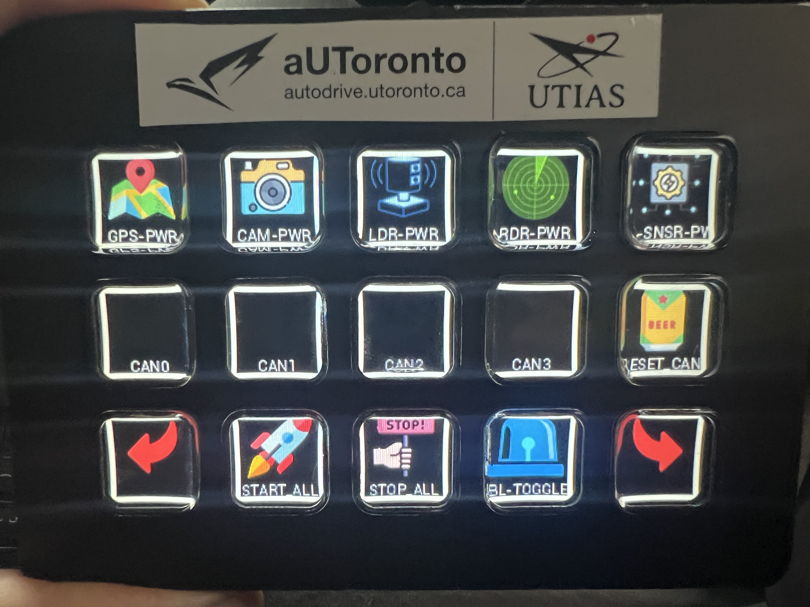

<video width="640" height="360" autoplay loop muted playsinline controls>
  <source src="../../asset/GUI_gif.mov" type="video/mp4">
  Your browser does not support the video tag.
</video>
<!--  -->

## Graphical User Interface Team at aUToronto

The University of Toronto's Self-Driving Car Team, [aUToronto](https://www.autodrive.utoronto.ca/), is a student-led design team that competes every year at the [GM/SAE AutoDrive Challenge Series](https://www.autodrivechallenge.com/). We are tasked with building a level 4 autonomous vehicle that can navigate through numerous static and dynamic challenges in an urban environment created at MCity, Michigan.

The team is named as the Graphical User Interface team but we developed all Human Machine Interfaces (HMI), including a web application running on the tablet to streamdecks for managing ROS nodes.

Artemis: our self-driving car. Source: aUToronto

### What is Level 4 Autonomy?

Level 4 autonomy refers to a vehicle's ability to drive itself without human intervention in most situations, but human control is optional in certain conditions.

At aUToronto, we work towards the following tasks:

1. Autonomous Navigation: Vehicles must navigate a complex urban environment autonomously, including handling intersections, traffic signals, and roundabouts.
2. Object Detection and Avoidance: Cars must detect and avoid pedestrians, deers, other vehicles, and obstacles in real-time.
3. Parking: Teams must develop systems for autonomous perpendicular parking.
4. Path Planning: Vehicles must create and follow an optimal path, considering dynamic and static objects.
5. Safety and Reliability: Ensuring the vehicle operates safely and reliably under various conditions, including inclement weather and different road types.

My involvement with aUToronto has been as follows:

1. August 2022 - June 2023: Graphical User Interface Team Member

- Developed a web application with a 2D interface to being able to select waypoints, display map and planned path

2. January 2024 - June 2024: Graphical User Interface Team Lead

- Developed 3D visualizations and helped with developing Streamdeck application to help managing the vehicle state

## What human machine interface do we need?

For passengers, we need an interface to visualize car states including obstacles and planned paths and also control or intervene the car if needed.
During autonomous testing and the actual challenge, engineers need to see exactly how the car perceives its environment in real-time, because standard terminal logs are difficult to look at quickly.

Since the team were only using RViz for debugging, the GUI team worked on the following tasks that even people with non-technical background can use it intuitively:

GUI System Architecture Diagram. Source: aUToronto

# 1. Developing a dual-panel 2D/3D view web application running on an Android tablet to select destinations and change the state to autonomous mode autonomously and visualize vehicle states.

- 2D dashboard for system health: Visualized planned path, obstacles, route planner panel on the right for the passenger to being able to select the waypoint, dashboards for planner and localization team's debugging, and a health monitor dashboard to check sensor and team stack status. We used React.js and Node.js.
- 3D visualizations for spatial awareness: Visualized:
  - obstacles using customized 3D glb files for complex objects like pedestrians and deers, and used Three.js custom plugin we developed for simple objects such as barrels and cones.
  - lanes
  - planned paths. We used Three.js and customized Foxglove with ROSBridge.

  

    
    
Car, pedestrian, deer, and stop sign; glb models. Source: aUToronto

  

  

    
    
Cone, barrel, and traffic light; three.js models. Source: aUToronto

  

<!-- 
Car, pedestrian, deer, and stop sign; glb model for 3D View. Source: aUToronto

Cone, barrel, and traffic light; three.js model for 3D View. Source: aUToronto -->

2D/3D Split View on Web Application. Source: aUToronto

# 2. Using streamdeck to start and stop any of our ROS nodes with a press of a button, allowing us to conform to the constraints given by the HMI Challenge.

Streamdeck used for HMI. Source: aUToronto

## Faced Challenges
