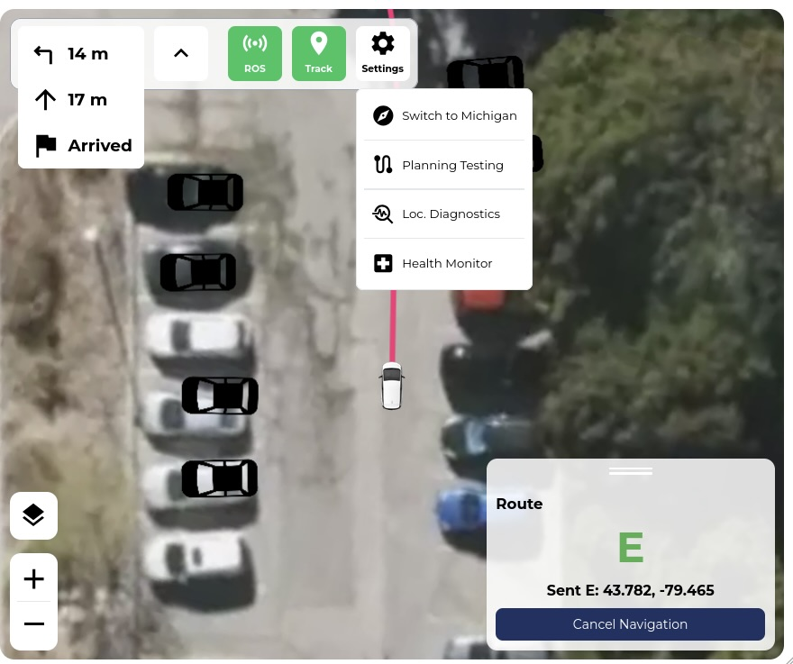
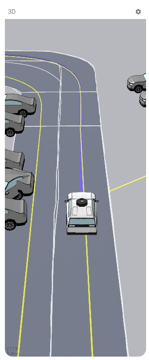
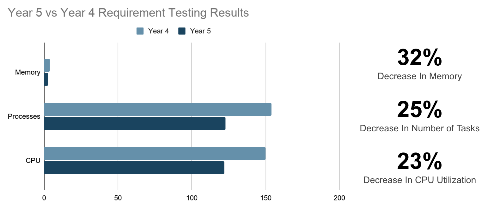
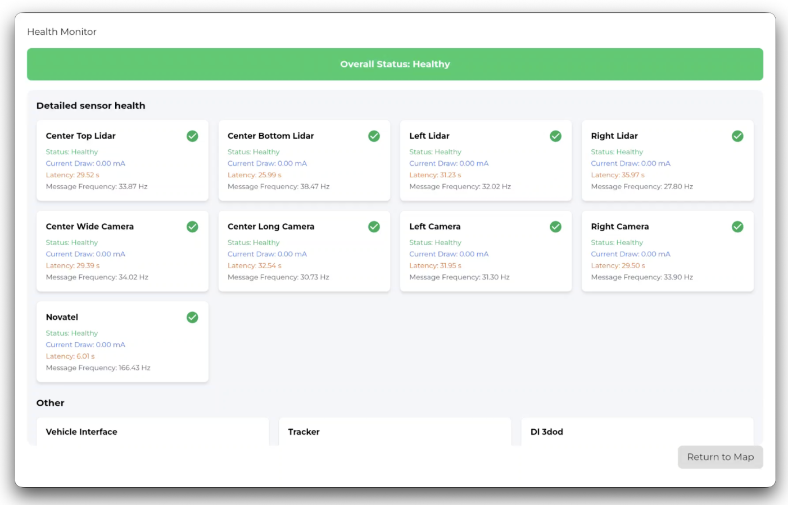
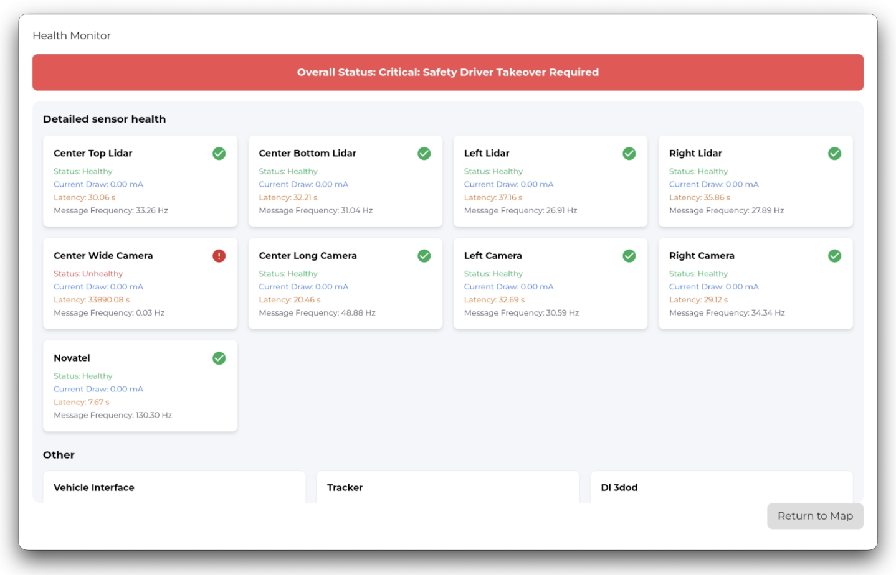

## An interface inside the car

[aUToronto](https://www.autodrive.utoronto.ca/) is the University of Toronto's self-driving car team. Our HMI brings vehicle state, navigation, perception, and stack health into a web interface on an in-cabin tablet.

I worked on the GUI sub-team and later led it. My work included 2D map interactions, 3D perception visualization, and integration with the vehicle software. The interface serves both passengers who need a clear view of the trip and engineers checking behavior during vehicle testing.

## From messages to a view

Vehicle messages need to become a consistent picture: where the car is, where it plans to go, and what it sees around it. The interface combines map and trajectory overlays with a Three.js scene and customized Foxglove tooling.

That makes coordinate handling and update timing part of the interface implementation. A path or object can look plausible while being in the wrong frame or showing an older state.

<figure><figcaption>The HMI's system architecture. Source: aUToronto.</figcaption></figure>

## Two views of the same vehicle

The 2D dashboard supports waypoint selection, route inspection, localization state, and diagnostics. The 3D view adds spatial context for detected objects and planned motion.

Both need to remain readable on a tablet. The goal is not to display every message field; it is to expose the state someone needs to interpret what the vehicle is doing.

<figure><figcaption>2D map and mission view.</figcaption></figure><figure><figcaption>3D perception view. Images: aUToronto.</figcaption></figure>

## When incoming data outruns rendering

During tablet testing, panning and rotating the 3D scene caused visible lag and dropped frames. Processing incoming spatial updates and re-rendering on every message arrival put ingestion and rendering on the same critical path.

I added a point-queue buffer to separate ROSBridge data ingestion from the Three.js render loop. The scene could then batch coordinate updates around the display's refresh cycle instead of attempting a full visual update for every incoming packet.

That changes the timing policy: rendering stays bounded by the screen, while incoming messages can arrive independently. It also means buffer behavior and freshness need attention; a smoother animation is useful only if the state stays current.

<figure><figcaption>The team's requirement-testing comparison. Source: aUToronto.</figcaption></figure>

## Health and operator controls

The health monitor displays sensor state, current draw, message frequency, and topic latency. Healthy, degraded, and takeover states make stack status visible without reading raw logs. This feature was co-developed with the System Safety team.

Physical Streamdeck controls let operators start and stop key ROS nodes. That software was developed by team principal Chad and former GUI lead William; I assisted with integration. It belongs in the system story without presenting it as my implementation.

<figure><figcaption>Health monitor: healthy state.</figcaption></figure><figure><figcaption>Health monitor: takeover state.</figcaption></figure>

## What this changed about my approach

This work made the interface feel like part of the robotics system. Rendering cost, transport, coordinate transforms, and state freshness affect what an operator can trust on screen.

The practical lesson was to inspect the whole path from a vehicle message to the displayed result. Moving work between layers can help, but the result still needs to be checked on the hardware where it will run.
