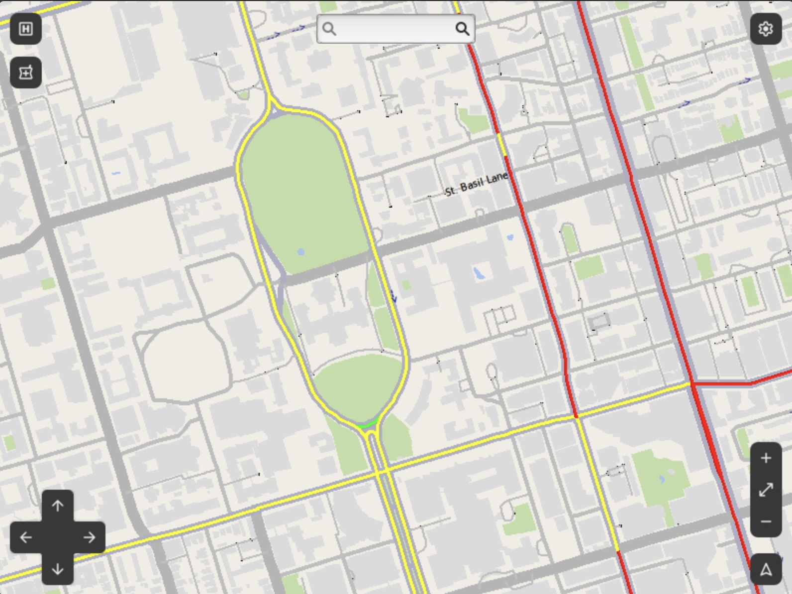

## A map with a specific job

MediPath is a mapping project built around an ambulance driver's workflow: find a hospital or pharmacy, choose a destination, and read the route without digging through several different views. We used C++ for the map and pathfinding engine, with GTK and EZGL for the desktop interface.

We wanted useful geographic information to be easy to act on. A route is only part of that experience; the destination details, search controls, and map rendering matter too.

## From streets to a route

The routing implementation uses A* and multi-Dijkstra algorithms, with multithreading for pathfinding work. The resulting path is highlighted on the map, and the navigation panel shows travel time and directions.

A* directs a search toward the destination using a heuristic. Dijkstra explores paths by accumulated cost. Working with both made the relationship between the graph representation, route cost, and search strategy concrete.

| Input | What the interface shows |
| --- | --- |
| Street or intersection search | A highlighted route and navigation instructions |
| Intersections selected on the map | A route between the chosen points |
| Hospital or pharmacy selection | Location details, including available hours and phone information |
| Traffic display enabled | Traffic speed information on the visible map |

## Making the map usable

Hospital and pharmacy layers can be toggled independently, so they do not always compete with the road network. Clicking a location opens its details. Users can search through the navigation panel or select intersections directly on the map.

TomTom traffic data adds another layer of context. The interface displays traffic with a red, yellow, and green speed scale. The overlay lets a driver inspect road conditions alongside the route.

<figure><figcaption>Traffic displayed alongside the map. Image from our project repository.</figcaption></figure>

## What the prototype demonstrates

The repository documents hospital and pharmacy discovery, text search, direct map selection, route instructions, traffic overlays, and a night mode. It also includes interface screenshots and a traffic demonstration video.

The screenshots and demo document the interface workflow. The project does not include a benchmark of routing performance or an emergency-response field trial.

## The part I find interesting

This project puts algorithms and interface design in the same loop. Computing a path is useful only if someone can find the destination, understand the result, and see enough context to make a decision. That connection is what makes a map more interesting to me than a pathfinding algorithm on its own.

[Explore the interface prototype in Figma ↗](https://www.figma.com/design/qTqsYCIitYf9UeCHXm1Det/ECE297-Design-Components)
