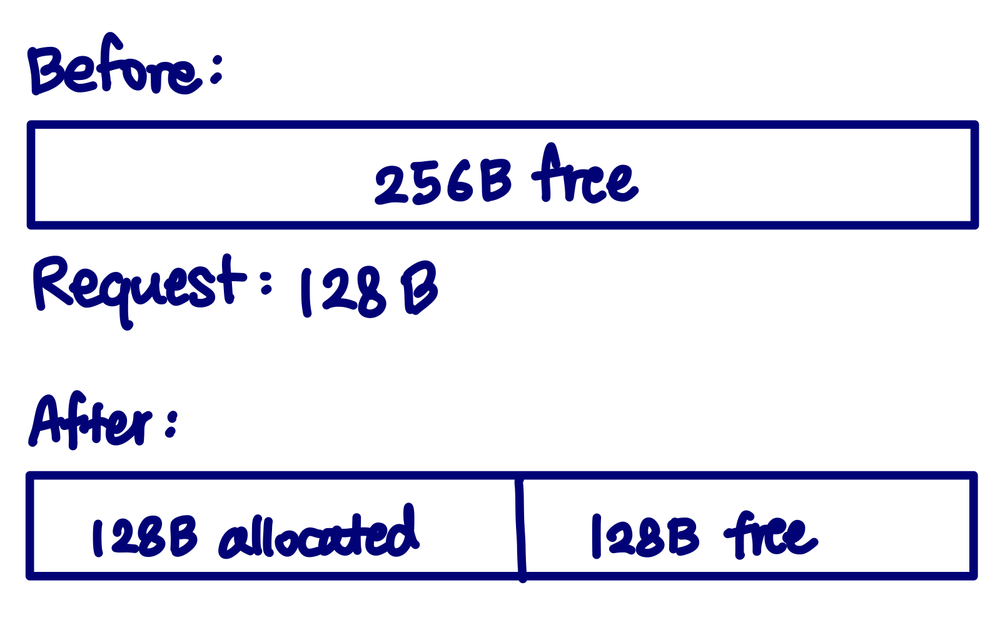
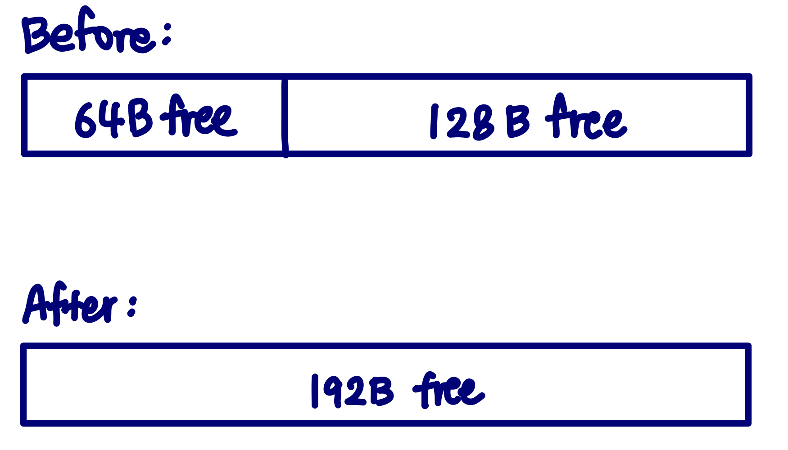
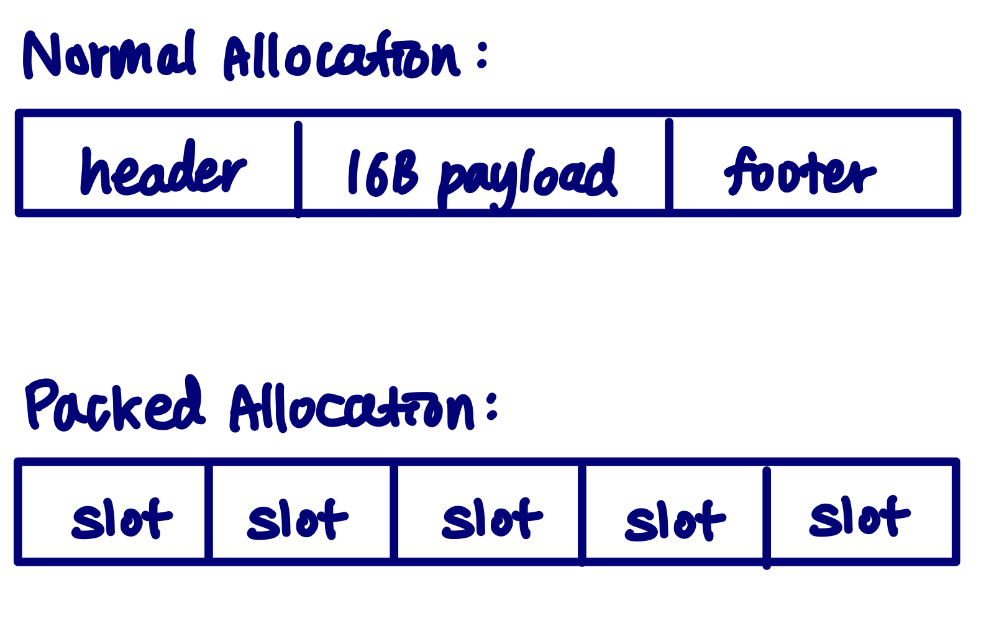

<!-- The Problem
Design Overview
Implementation
Key Design Decisions
Testing & Validation
Trade-offs / What I Learned -->

## Below the API

`malloc()` looks like a simple function call, but underneath it an allocator has to decide where to place memory, how to reuse freed blocks, and how to prevent the heap from becoming fragmented over time.

I wanted to understand those decisions beyond the API, so I implemented my own versions of `malloc`, `free`, and `realloc` and experimented with how different allocation policies affect memory utilization and performance.

## Organizing the heap

The allocator manages the heap as a sequence of variable-sized blocks. Each block stores metadata describing its size and whether it is currently allocated.

Free blocks are organized into nine **segregated free lists** based on their size. Instead of scanning every unused block in the heap, an allocation request begins searching in the smallest size class that could satisfy it and only moves to larger classes when necessary.

For example, a request that needs a roughly 100-byte block begins searching the `<=128 B` class rather than examining unrelated multi-kilobyte blocks.

## Implementation

Each normal heap block contains a header and footer storing its size and allocation state. Free blocks additionally use their payload space to store `next` and `previous` pointers, forming doubly linked free lists.

Blocks are kept 16-byte aligned, so requested sizes are rounded up to a multiple of 16 after accounting for allocator metadata. This keeps returned addresses suitably aligned while also making block traversal predictable.

When `malloc` receives a request, the allocator:

1. Computes the aligned block size including metadata.
2. Chooses the corresponding free-list size class.
3. Searches for a sufficiently large free block.
4. Splits the block if the unused remainder is large enough to remain useful.
5. Extends the heap if no existing block can satisfy the request.

For example:

  
  <!-- 
malloc
 -->

The remaining free portion is inserted back into the appropriate size class instead of being wasted inside the allocated block.

## Coalescing and Fragmentation

Repeated allocations and frees can leave the heap broken into many small pieces even when the total amount of free memory is large.

To reduce this external fragmentation, `free` checks the physical blocks immediately before and after the released block. Adjacent free blocks are merged into a larger block before being returned to the free list.

  

The allocator handles all four neighboring states: both neighbors allocated, only the previous block free, only the next block free, or both neighbors free.

## Optimizing `realloc`

A simple implementation of `realloc` can always allocate a new block, copy the old payload, and free the original block. That works, but repeatedly growing an object can cause unnecessary memory copies.

My allocator first tries to grow the existing block in place.

If the block immediately after it is free, that memory can be absorbed into the current allocation. If the block reaches the end of the heap, the heap can be extended directly while preserving the same pointer.

Only when the block cannot grow in place does the allocator fall back to:

Allocate a replacement block, copy the payload, then release the original block.

Relocated `realloc` blocks are placed at the high end of a free block, leaving the remainder before the new allocation. This changes which physical neighbors can be used for later growth; the benefit depends on the surrounding heap layout.

## Small Allocation Experiment

Small allocations expose another allocator trade-off: metadata can become a significant fraction of the total memory usage.

A normal minimum-sized block in this allocator is 32 bytes, so storing a 16-byte object individually can double its effective memory footprint.

I experimented with a small-object path that packs fixed-size allocations into a shared block. It is enabled when the first allocation in a trace is tiny; traces starting with a larger allocation stay on the normal path:

  

The packed slots do not require their own header and footer, reducing metadata overhead for workloads containing many tiny objects.

This optimization is workload-specific rather than a general replacement for the normal allocation path, but it helped me explore the trade-off between allocator simplicity and utilization.

## Testing and validation

From `src`, `make` builds the benchmark and `./bench -v` reports each trace. `./bench -l` also measures libc allocation on those traces. Utilization is peak live payload divided by peak heap size; throughput is allocator operations per second. These are workload measurements, not a claim that this allocator outperforms a production allocator in general.

I evaluated the allocator using the repository’s trace benchmark driver across traces containing:

- random allocation and free patterns
- interleaved small and large allocations
- repeated `realloc` operations
- coalescing-heavy workloads
- large numbers of small objects

The driver exercises both allocator correctness and performance-related behavior such as memory utilization and allocation throughput.

I also implemented a heap consistency checker that verifies allocator invariants such as matching headers and footers, correct size-class membership, valid free-list links, successful coalescing, and valid heap boundaries.

## What I Learned

The interesting part of building an allocator was not implementing `malloc` itself, but seeing how small policy decisions change the behavior of the entire heap.

A more aggressive search policy can reduce fragmentation but increase allocation latency. Splitting blocks improves utilization but creates more free-list bookkeeping. Coalescing recovers large contiguous regions but adds work to `free`. Optimizing `realloc` can avoid expensive memory copies, but requires reasoning about the physical layout of neighboring blocks.

Implementing these mechanisms made the behavior hidden behind `malloc`, `free`, and `realloc` much more concrete and gave me a better understanding of how system software trades CPU time, metadata overhead, locality, and fragmentation against one another.

